# flask_petclinic

## dev environment

### git - github
* [https://github.com/Jakarta-EE-Petclinic/petclinic_flask.git](https://github.com/Jakarta-EE-Petclinic/petclinic_flask.git)

````bash
    git clone git@github.com:Jakarta-EE-Petclinic/petclinic_flask.git
````

### setup

````bash
    make venv
    . ./venv/bin/activate
    make start
    ./run.sh
````

### run testserver

````bash
    . ./venv/bin/activate
    ./run.sh
````

### update dependencies

````bash
    . ./venv/bin/activate
    make update
 ````

### change configuration

````bash
    vim project/app_config/app_config.py
    vim project/app_config/database.py
    vim requirements/in/build.in
    make start
````

### change dependencies

````bash
    . ./venv/bin/activate
    vim requirements/in/build.in
    vim requirements/in/docs.in
    vim requirements/in/tests.in
    vim requirements/in/typing.in
    vim requirements/in/dev.in
    vim requirements/in/linux.in
    vim requirements/in/windows.in
    make update
````

## UML

### Domain_Class_Modell

#### Entities_Petclinic

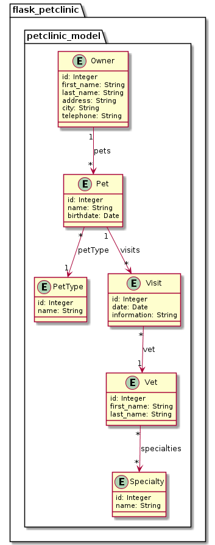

#### Entities_Application

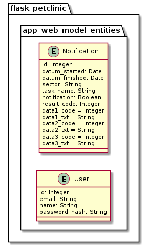

#### Transient_Application

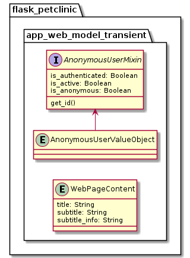

### Use Cases

#### Use Cases user
* usecase login as uc1000
* usecase logout as uc1001
* usecase userprofile as uc1002
* usecase userlist as uc1003

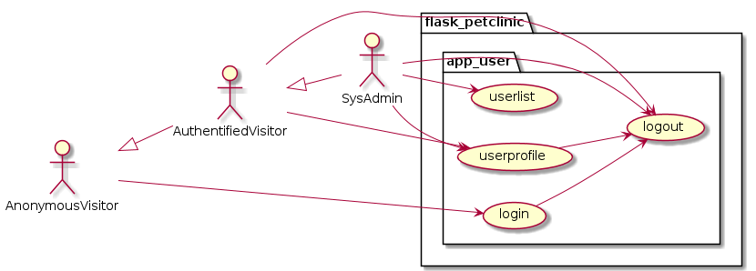

#### Use Cases notification
* usecase notification_list as uc1010

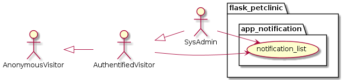


#### Use Cases app_web
* usecase db_create as uc1020
* usecase db_drop_and_create as uc1021
* usecase db_dump as uc1022
* usecase db_dump_reimport as uc1023
* usecase db_table_count as uc1024

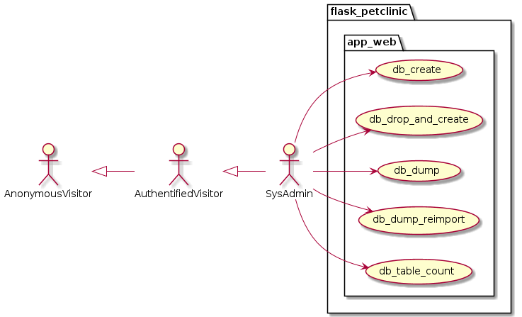

#### Use Cases petclinic_specialty
* usecase specialty_search as uc2000
* usecase specialty_list as uc2001
* usecase specialty_new as uc2002
* usecase specialty_change as uc2003
* usecase specialty_remove as uc2004

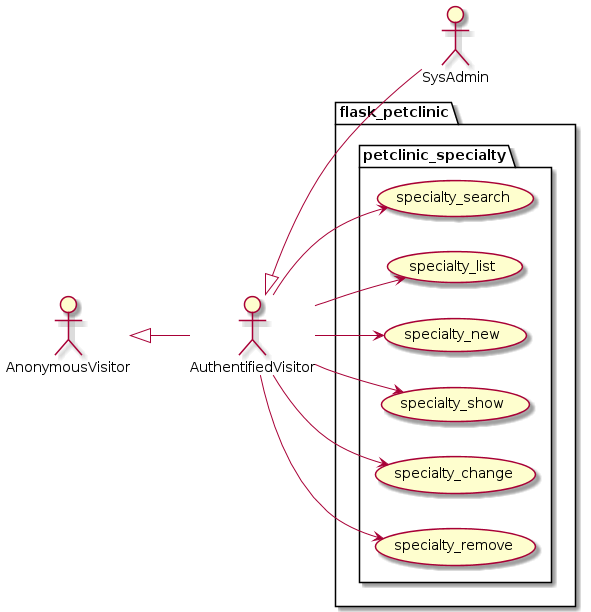

#### Use Cases petclinic_vet
* usecase vet_search as uc3000
* usecase vet_list as uc3001
* usecase vet_new as uc3002
* usecase vet_show as uc3003
* usecase vet_change as uc3004
* usecase vet_choose_specialties as uc3005
* usecase vet_remove as uc3006

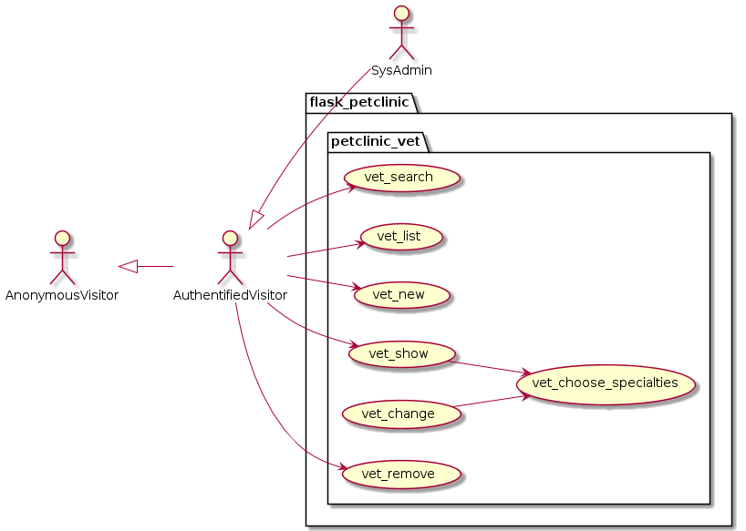

#### Use Cases petclinic_pettype
* usecase pettype_search as uc4000
* usecase pettype_list as uc4001
* usecase pettype_new as uc4002
* usecase pettype_change as uc4003
* usecase pettype_remove as uc4004

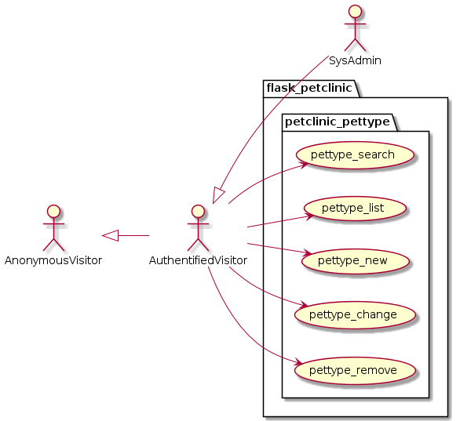

#### Use Cases petclinic_pet
* usecase pet_search as uc5000
* usecase pet_list as uc5001
* usecase pet_new as uc5002
* usecase pet_change as uc5003
* usecase pet_remove as uc5004
* usecase pet_choose_pettype as uc5005

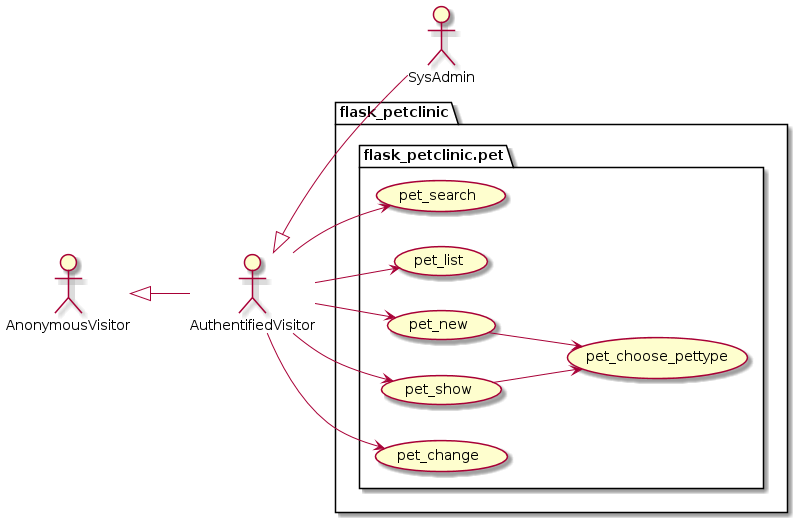

#### Use Cases petclinic_owner
* usecase owner_search as uc6000
* usecase owner_list as uc6001
* usecase owner_new as uc6002
* usecase owner_show as uc6003
* usecase owner_change as uc6004
* usecase owner_remove as uc6005

* usecase owner_pet_list as uc5010
* usecase owner_pet_add_new as uc5011
* usecase owner_pet_show as uc5012
* usecase owner_pet_change as uc5013
* usecase owner_pet_remove as uc5014
* usecase owner_pet_give_to_another_owner as uc5015

* usecase owner_pet_visits_list as uc7010
* usecase owner_pet_visits_add_new as uc7011
* usecase owner_pet_visits_change as uc7012
* usecase owner_pet_visits_remove as uc7013


#### Use Cases petclinic_visit
* usecase visit_search as uc7000
* usecase visit_list as uc7001
* usecase visit_new as uc7002
* usecase visit_show as uc7003
* usecase visit_change as uc7004
* usecase visit_remove as uc7005

* usecase pet_list_visits as uc7020
* usecase pet_add_visit_to_pet_and_vet as uc7021
* usecase pet_change_visit_to_pet_and_vet as uc7022
* usecase pet_remove_visit as uc7023

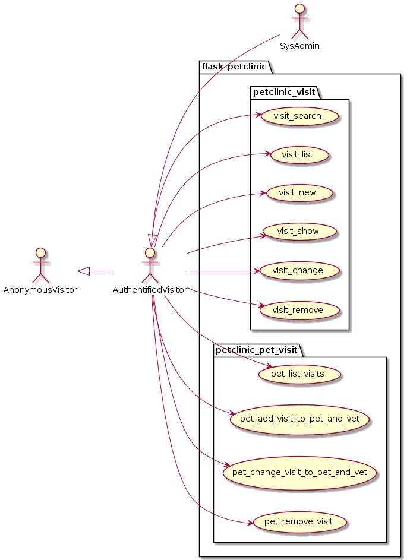

