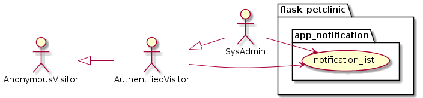

# Changes

## Domain_Class_Modell

### Entities_Petclinic

## Use Cases

### Use Cases app_user

* usecase login as uc1000
* usecase logout as uc1001
* usecase userprofile as uc1002
* usecase userlist as uc1003

### Use Cases app_notification

* usecase notification_list as uc1010

### Use Cases app_web

* usecase db_create as uc1020
* usecase db_drop_and_create as uc1021
* usecase db_dump as uc1022
* usecase db_dump_reimport as uc1023
* usecase db_table_count as uc1024

### Use Cases petclinic_specialty

* usecase specialty_search as uc2000
* usecase specialty_list as uc2001
* usecase specialty_new as uc2002
* usecase specialty_change as uc2003
* usecase specialty_remove as uc2004

### Use Cases petclinic_vet

* usecase vet_search as uc3000
* usecase vet_list as uc3001
* usecase vet_new as uc3002
* usecase vet_change as uc3003
* usecase vet_choose_specialties as uc3004
* usecase vet_remove as uc3005

### Use Cases petclinic_pettype

* usecase pettype_search as uc4000
* usecase pettype_list as uc4001
* usecase pettype_new as uc4002
* usecase pettype_change as uc4003
* usecase pettype_remove as uc4004

### Use Cases petclinic_pet

* usecase pet_search as uc5000
* usecase pet_list as uc5001
* usecase pet_new as uc5002
* usecase pet_change as uc5003
* usecase pet_remove as uc5004
* usecase pet_choose_pettype as uc5005

### Use Cases petclinic_owner

* usecase owner_search as uc6000
* usecase owner_list as uc6001
* usecase owner_change as uc6002
* usecase owner_new as uc6003
* usecase owner_add_new_pet as uc6004
* usecase owner_change_pet as uc6005
* usecase owner_remove_pet as uc6006

### Use Cases petclinic_visit

* usecase pet_list_visits as uc7000
* usecase pet_add_visit_to_pet_and_vet as uc7001
* usecase pet_change_visit_to_pet_and_vet as uc7002
* usecase pet_remove_visit as uc7003

### 0.0.1 Release

* dasdasdasdasda test 1 2 3

### 0.0.2 Release

