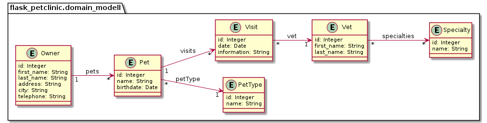
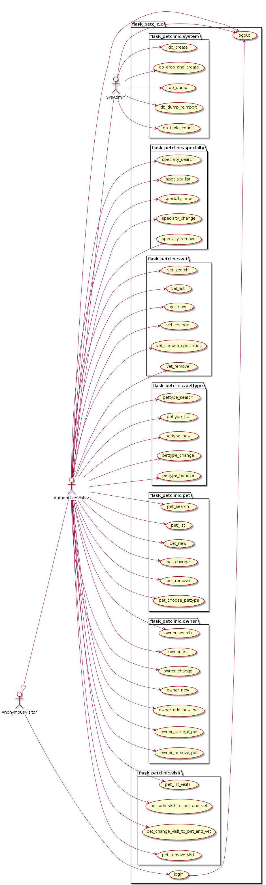

# flask_petclinic

* Version 0.0.1

## git

* [https://github.com/thomaswoehlke/flask_petclinic.git](https://github.com/thomaswoehlke/flask_petclinic.git)

````bash
    git clone git@github.com:thomaswoehlke/flask_petclinic.git
````

## setup and run

````bash
    make venv
    . ./venv/bin/activate
    make start
    ./run.sh
````

and in another termninal:

````bash
    . ./venv/bin/activate
    python app.py
````

## update dependencies

````bash
    . ./venv/bin/activate
    make update
 ````

## change configuration

````bash
    vim project/app_config/app_config.py
    vim project/app_config/database.py
    vim requirements/in/build.in
    make start
````

## change dependencies

````bash
    . ./venv/bin/activate
    vim requirements/in/build.in
    vim requirements/in/docs.in
    vim requirements/in/tests.in
    vim requirements/in/typing.in
    vim requirements/in/dev.in
    vim requirements/in/linux.in
    vim requirements/in/windows.in
    make update
````

## UML

### Domain Class Modell



### Use Cases


