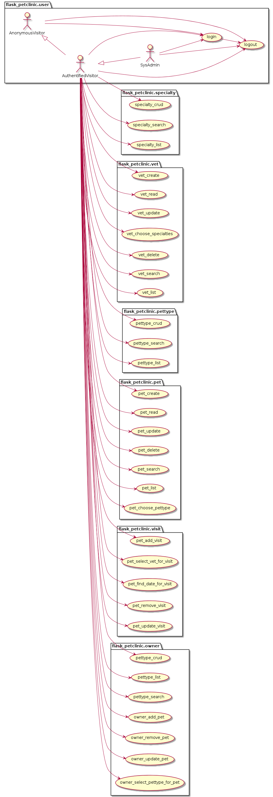

# flask_petclinic

* Version 0.0.1

## git

* [https://github.com/thomaswoehlke/flask_petclinic.git](https://github.com/thomaswoehlke/flask_petclinic.git)

````bash
    git clone git@github.com:thomaswoehlke/flask_petclinic.git
````

## setup and run

````bash
    make venv
    . ./venv/bin/activate
    make start
    ./run.sh
````

and in another termninal:

````bash
    . ./venv/bin/activate
    python app.py
````

## update dependencies

````bash
    . ./venv/bin/activate
    make update
 ````

## change configuration

````bash
    vim project/config/config.py
    vim project/config/database.py
    vim requirements/in/build.in
    make start
````

## change dependencies

````bash
    . ./venv/bin/activate
    vim requirements/in/build.in
    vim requirements/in/docs.in
    vim requirements/in/tests.in
    vim requirements/in/typing.in
    vim requirements/in/dev.in
    vim requirements/in/linux.in
    vim requirements/in/windows.in
    make update
````

## Data Sources

* [WHO](https://covid19.who.int/WHO-COVID-19-global-data.csv)
* [ecdc.europa](https://opendata.ecdc.europa.eu/covid19/casedistribution/csv)
* [ecdc.europa - Information](https://www.ecdc.europa.eu/en/publications-data/download-todays-data-geographic-distribution-covid-19-cases-worldwide)
* [OWID: covid-19-data](https://github.com/owid/covid-19-data)
* [OWID: covid-vaccinations](https://ourworldindata.org/covid-vaccinations)
* [OWID: coronavirus-data-explorer](https://ourworldindata.org/explorers/coronavirus-data-explorer)

## Python

* [flask](https://flask.palletsprojects.com/en/1.1.x/)
* [flask: pypi](https://pypi.org/project/Flask/)
* [flask: flask-admin](https://github.com/flask-admin/flask-admin/)
* [flask: werkzeug](https://werkzeug.palletsprojects.com/en/1.0.x/)
* [flask: sqlalchemy](https://flask.palletsprojects.com/en/1.1.x/patterns/sqlalchemy/)
* [sqlalchemy](https://docs.sqlalchemy.org/en/13/)
* [sqlite](https://sqlite.org/docs.html)
* [jinja](https://jinja.palletsprojects.com/en/2.11.x/)
* [jinja: markupsafe](https://palletsprojects.com/p/markupsafe/)
* [jinja: itsdangerous](https://palletsprojects.com/p/itsdangerous/)
* [jinja: click](https://palletsprojects.com/p/click/)

### Info

* [sqlalchemy-query-with-or-and-like-common-filters](http://www.leeladharan.com/sqlalchemy-query-with-or-and-like-common-filters)
* [pagination-route-example-with-flask-sqlalchemy-paginate](https://riptutorial.com/flask/example/22201/pagination-route-example-with-flask-sqlalchemy-paginate)

### Dependencies

* [fixing-conflicting-dependencies](https://pip.pypa.io/en/latest/user_guide/#fixing-conflicting-dependencies)

## UML

### all

#### Domain Class Modell


#### all_use_cases


### app_web

#### app_web_domain_model


#### app_web_use_cases


