# UML

## Domain_Class_Modell

### Entities_Petclinic

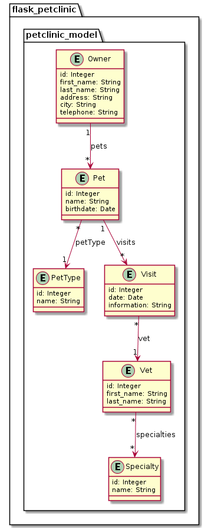

### Entities_Application

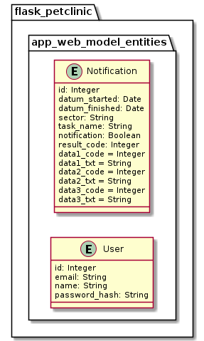

### Transient_Application

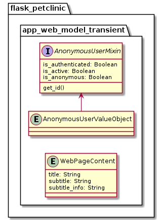

## Use Cases app_web

### Use Cases user
* usecase login as uc1000
* usecase logout as uc1001
* usecase userprofile as uc1002
* usecase userlist as uc1003

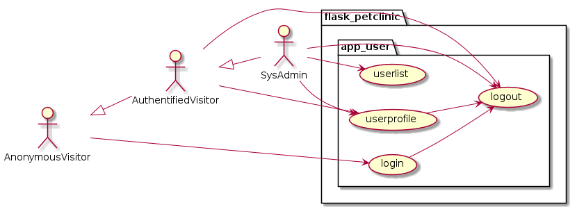

### Use Cases Notification
* usecase notification_list as uc1100

### Use Cases app_web Service
* usecase db_create as uc1200
* usecase db_drop_and_create as uc1201
* usecase db_dump as uc1202  uc1022
* usecase db_dump_reimport as uc1203
* usecase db_table_count as uc1204

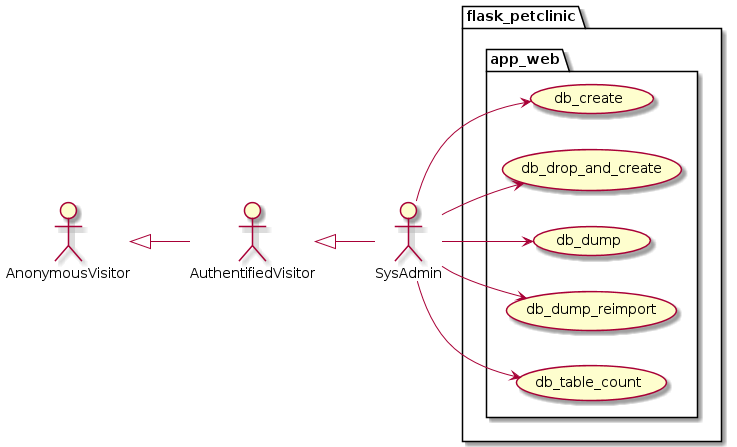

## Use Cases Petclinic

### Use Cases petclinic_specialty
* usecase specialty_search as uc2000
* usecase specialty_list as uc2001
* usecase specialty_new as uc2002
* usecase specialty_change as uc2003

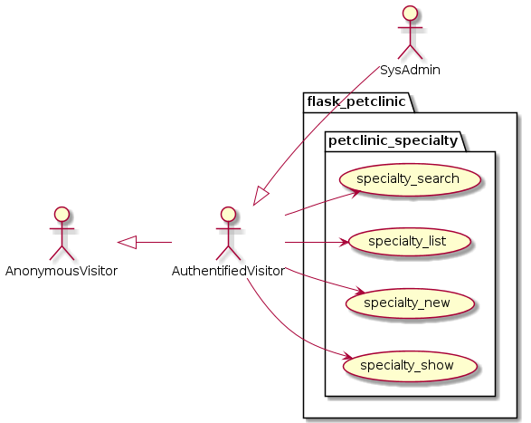

### Use Cases petclinic_vet
* usecase vet_search as uc3000
* usecase vet_list as uc3001
* usecase vet_new as uc3002
* usecase vet_show as uc3003
* usecase vet_change as uc3004
* usecase vet_choose_specialties as uc3005

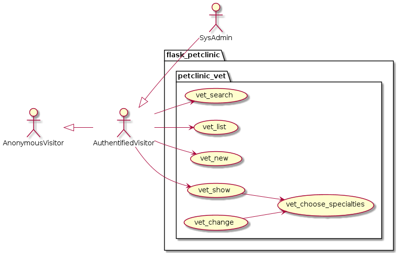

### Use Cases petclinic_pettype
* usecase pettype_search as uc4000
* usecase pettype_list as uc4001
* usecase pettype_new as uc4002
* usecase pettype_change as uc4003

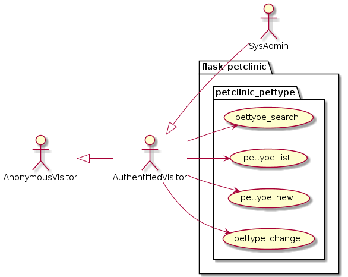

### Use Cases petclinic_pet
* usecase pet_search as uc5000
* usecase pet_list as uc5001
* usecase pet_new as uc5002
* usecase pet_change as uc5003
* usecase pet_choose_pettype as uc5005

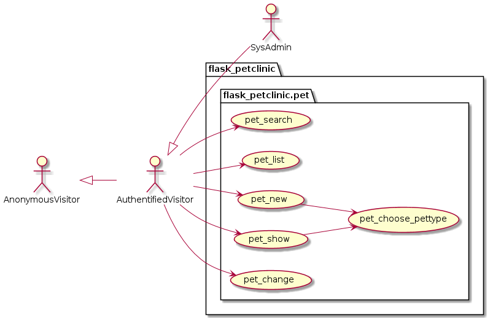

### Use Cases petclinic_visit
* usecase visit_search as uc6000
* usecase visit_list as uc6001
* usecase visit_new as uc6002
* usecase visit_show as uc6003
* usecase visit_change as uc6004

* usecase pet_list_visits as uc6020
* usecase pet_add_visit_to_pet_and_vet as uc6021
* usecase pet_change_visit_to_pet_and_vet as uc6022

* usecase visit_search as uc7000
* usecase visit_list as uc7001
* usecase visit_new as uc7002
* usecase visit_show as uc7003
* usecase visit_change as uc7004

* usecase pet_list_visits as uc7020
* usecase pet_add_visit_to_pet_and_vet as uc7021
* usecase pet_change_visit_to_pet_and_vet as uc7022

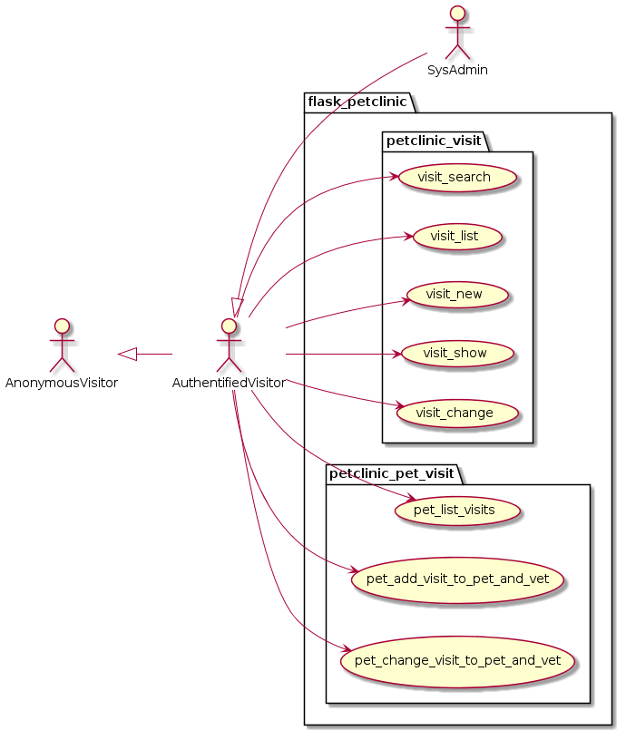

### Use Cases petclinic_owner
* usecase owner_search as uc6000
* usecase owner_list as uc6001
* usecase owner_new as uc6002
* usecase owner_show as uc6003
* usecase owner_change as uc6004

* usecase owner_pet_list as uc5010
* usecase owner_pet_add_new as uc5011
* usecase owner_pet_show as uc5012
* usecase owner_pet_change as uc5013
* usecase owner_pet_give_to_another_owner as uc5015

* usecase owner_pet_visits_list as uc7010
* usecase owner_pet_visits_add_new as uc7011
* usecase owner_pet_visits_change as uc7012

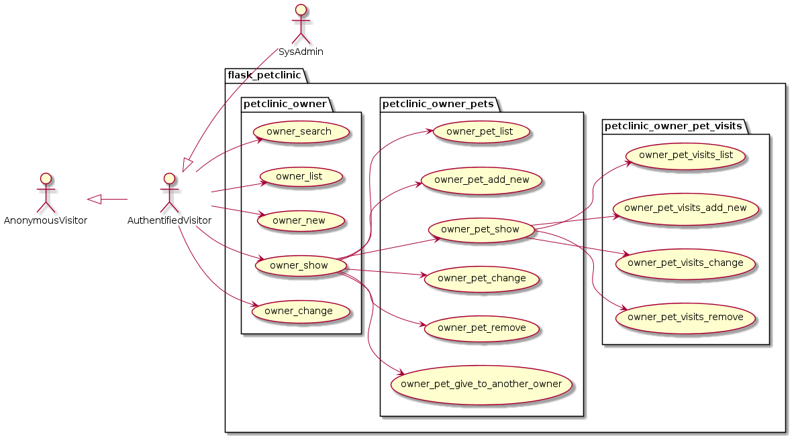
